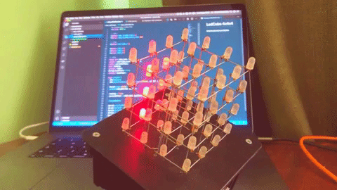

# LedCube 4x4x4
Led cube 4x4x4 on Arduino

# Cube modes
Const | ID | Description
-----|--|------------
CUBE_COLUMN_CIRCLE | 1 | One column running on outside round
CUBE_LIGHT | 2 | Alight cube
CUBE_BLINK | 3 | Blink cube
CUBE_RAIN | 4 | effect "rain"

Task Lists
- [x] create starter project
- cube modes
    - [x] running column
    - [x] alight cube
    - [x] blink cube
    - [x] effect rain
    - [ ] random cube filling
    - [ ] random direction shake
    - [ ] moving plane
- [ ] rebuild device on NodeMCU platform for switching mode from WebClient
- [ ] (?) add button on device for switching modes
