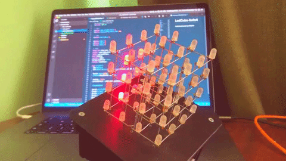

# LedCube 4x4x4
Led cube 4x4x4 on Arduino

## Cube modes
Const | ID | Description
-----|--|------------
CUBE_COLUMN_CIRCLE | 1 | One column running on outside round
CUBE_LIGHT | 2 | Alight cube
CUBE_BLINK | 3 | Blink cube
CUBE_RAIN | 4 | Effect "rain"
CUBE_GLOWING | 5 | Random cube filling
CUBE_FILLING | 6 | Random direction shake
CUBE_PLANE_MOVING | 7 | Random moving plane

##### Gif with cube modes

##### [Schematic of project](https://github.com/smuchka/led-cube-4x4x4/blob/develop/files/Schematic_LE_%20cube_4x4x4.png)

## Task
- [x] create starter project
- several mode
    - [x] running column
    - [x] alight cube
    - [x] blink cube
    - [x] effect rain
    - [x] random cube filling
    - [x] random direction shake
    - [x] moving plane
- switching mode outside code
    - [ ] rebuild device on NodeMCU platform
    - [ ] add button on device
